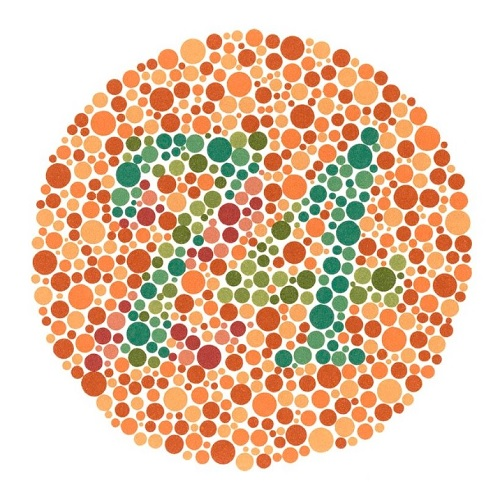
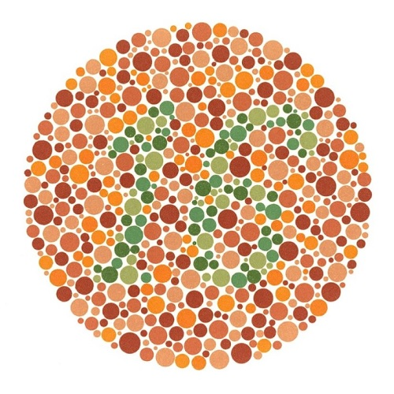
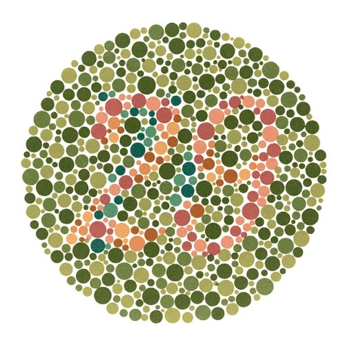
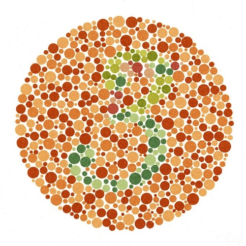

# The Ishihara Colour Test

The pictures (called plates) are shown below from 1 to 12.  Identify the number embedded within the picture and check if you managed to identify all of them correctly [here](assets/ishihara_test/answers.md).

#### Plate 1:

  
 

#### Plate 2:

  
 

#### Plate 3:

  
 

#### Plate 4:

  
 

#### Plate 5:

  
 

#### Plate 6:

  
 

#### Plate 7:

  
 

#### Plate 8:

  
 

#### Plate 9:

  
 

#### Plate 10:

  
 

#### Plate 11:

  
 

#### Plate 12:

  
 

