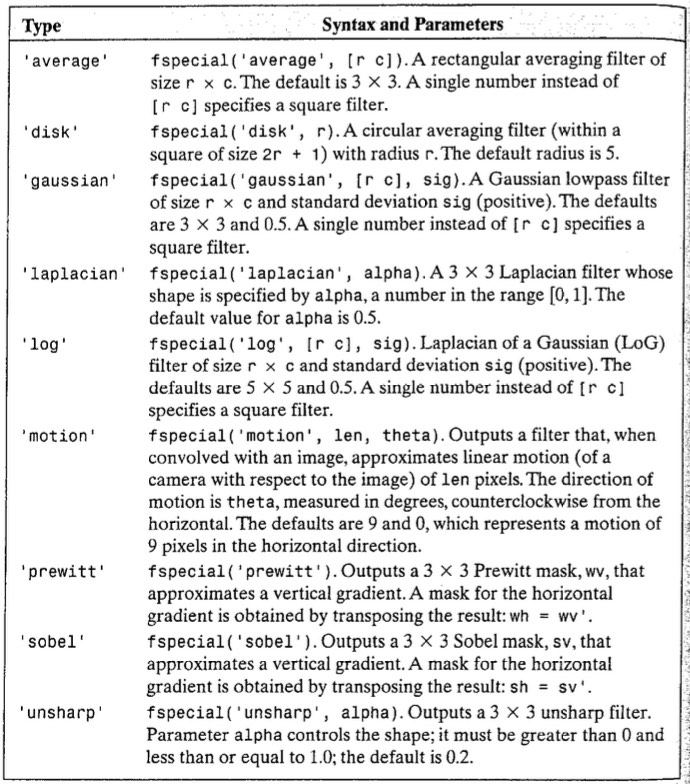

# Lab 3 - Intensity Transformation and Spatial Filtering
*_Peter Cheung, version 1.0, 1 Feb 2024_*

This lab session aims to demonstrate the topics covered in Lectures 4 and 5 using Matlab.  The choice of Matlab is driven by their excellent set of functions included in the Image Processing Toolbox.  As Design Engineers, it is more important for you to understand the principles and then use ready-made libraries to perform processing on visual data, than to write low-level code to implement the algorithms.

Clone this repo to your laptop and do all your work using your local copy.  Remember to keep a log of your work in your repo.

## Task 1 - Contrast enhancement with function imadjust

### Importing an image

Check what is on image file *_breastXray.tif_* stored in the assets folder and read the image data into the matrix *_f_*, and display it:

```
clear all
imfinfo('assets/breastXray.tif')
f = imread('assets/breastXray.tif');
imshow(f)
```
>Note: Use the semicolon to suppress output. Otherwise, all pixel values will be stream to your display and will take a long time. Use CTRL-C to interrupt.

Check the dimension of _f_ on the right window pane of Matlab. Examine the image data stored:

```
f(3,10)             % print the intensity of pixel(3,10)
imshow(f(1:241,:))  % display only top half of the image
```
Indices of 2D matrix in Matlab is of the format: (row, column).  You can use *_':'_* to *_slice_* the data.  *_(1:241 , : )_* means only rows 1 to 241 and all columns are used.  The default is the entire matrix.

To find the maximum and minimum intensity values of the image, do this:
```
[fmin, fmax] = bounds(f(:))
```
*_bounds_* returns the maximum and minimum values in the entire image f. The index ( : ) means every columns. If this is not specified, Matlab will return the max and min values for each column as 2 row vectors.

Since the data type for _f_ is _uint8_, the full intensity range is [0 255].  Is the intensity of _f_ close to the full range?

**Test yourself**: Display the right half of the image. Capture it for your logbook.

### Negative image

To compute the negative image and display both the original and the negative image side-by-side, do this:

```
g1 = imadjust(f, [0 1], [1 0])
figure                          % open a new figure window
imshowpair(f, g1, 'montage')
```
>The 2nd parameter of _imadjust_ is in the form of [low_in high_in], where the values are between 0 and 1.  [0 1] means that the input image is to be adjusted to within 1% of the bottom and top pixel values.  

>The 3rd parameter is also in the form of [low_out high_out]. It specifies how the input range is mapped to output range.  So, [1 0] means that the lowest pixel intensity of the input is now mapped to highest pixel intensity at the output and vice versa.  This of course means that all intensities are inverted, producing the negative image.  The same thing can be achieved using _function imcomplement_.

### Gamma correction

Try this:
```
g2 = imadjust(f, [0.5 0.75], [0 1]);
g3 = imadjust(f, [ ], [ ], 2);
figure
montage({g2,g3})
```
_g2_ has the gray scale range between 0.5 and 0.75 mapped to the full range.

_g3_ uses gamma correct with gamma = 2.0 as shown in the diagram below. [ ] is the same as [0 1] by default.

<p align="center">  </p><BR>

This produces a result similar to that of g2 by compressing the low end and expanding the high end of the gray scale.  It however, unlike g2,  retains more of the details because the intensity now covers the entire gray scale range.  _function montage_ stitches together images in the list specified within { }.

## Task 2: Contrast-stretching transformation

Instead of using the *_imadjust function_*, we will apply the constrast stretching transformation function in Lecture 4 slide 4 to improve the contrast of another X-ray image.  The transformation function is as shown here:

<p align="center">  </p><BR>

The equation of this function is:

$$s = T(r) = {1 \over 1 + (k/r)^E}$$

where *_k_* is often set to the average intensity level and E determines steepness of the function. Note that the 

```
clear all       % clear all variables
close all       % close all figure windows
f = imread('assets/bonescan-front.tif');
r = double(f);  % uint8 to double conversion
k = mean2(r);   % find mean intensity of image
E = 0.9;
s = 1 ./ (1.0 + (k ./ (r + eps)) .^ E);
g = uint8(255*s);
imshowpair(f, g, "montage")
```
_esp_ is a special Matlab constant which has the smallest value possible for a double precision floating point number on your computer.  Adding this to _r_ is necessary to avoid division by 0.

Matlab function *_mean2_* computes the average value of a 2-D matrix.  Since the equation operates on floating numbers, we need to convert the image intensity, which is of type _uint8_ to type _double_ and store it in _r_.  We then compute the contrast stretched image by applying the stretch function element-by-element, and store the result in _s_.  

The intensity values of s are normalized to the range of [0.0 1.0] and is in type _double_.  Finally we scale this back to the range [0 255] and covert back to _uint8_.

Discuss the results with your classmates and record your observations in your logbook.

## Task 3: Contrast Enhancement using Histogram

### PLotting the histogram of an image

Matlab has a built-in function _imhist_ to compute the histogram of an image and plot it.  Try this:

```
clear all       % clear all variable in workspace
close all       % close all figure windows
f=imread('assets/pollen.tif');
imshow(f)
figure          % open a new figure window
imhist(f);      % calculate and plot the histogram
```
It is clear that the intesity level of this image is very much squashed up between 70 to 140 in the range [0 255].  One attempt is to stretch the intensity between 0.3 and 0.55 of full scale (i.e. 255) with the built-in function _imadjust_ from the previous tasks. Try this:

```
close all
g=imadjust(f,[0.3 0.55]);
montage({f, g})     % display list of images side-by-side
figure
imhist(g);
```
The histogram of the adjusted image is more spread out.  It is definitely an improvement but it is still not a good image.

### Histogram, PDF and CDF

Probability distribution function (PDF) is simply a normalised histogram.  Cumulative distribution function (CDF) is the integration of cumulative sum of the PDF.  Both PDF and CDF can be obtained as below.  Note that _numel_ returns the total number of elements in the matrix.  The following code computs the PDF and CDF for the adjusted image _g_, and plot them side-by-side in a single figure.  The function _subplot(m, n, p)_ specifies which subplot is to be used.

```
g_pdf = imhist(g) ./ numel(g);  % compute PDF
g_cdf = cumsum(g_pdf);          % compute CDF
close all                       % close all figure windows
imshow(g);
subplot(1,2,1)                  % plot 1 in a 1x2 subplot
plot(g_pdf)
subplot(1,2,2)                  % plot 2 in a 1x2 subplot
plot(g_cdf)
```

### Histogram Equalization

To perform histogram equalization, the CDF is used as the intensity transformation function.  The CDF plot made earlier is bare and axes are not labelled nor scaled.  The following code replot the CDF and make it looks pretty.  It is also an opportunity to demonstrate some of Matlab's plotting capabilities.

```
x = linspace(0, 1, 256);    % x has 256 values equally spaced
                            %  .... between 0 and 1
figure
plot(x, g_cdf)
axis([0 1 0 1])             % graph x and y range is 0 to 1
set(gca, 'xtick', 0:0.2:1)  % x tick marks are in steps of 0.2
set(gca, 'ytick', 0:0.2:1)
xlabel('Input intensity values', 'fontsize', 9)
ylabel('Output intensity values', 'fontsize', 9)
title('Transformation function', 'fontsize', 12)
```

The Matlab function _histeq_ computes the CDF of an image, and use this as the intensity transformation function to flatten the histogram.  The following code will perform this function and provide plots of all three images and their histogram.

```
h = histeq(g,256);              % histogram equalize g
close all
montage({f, g, h})
figure;
subplot(1,3,1); imhist(f);
subplot(1,3,2); imhist(g);
subplot(1,3,3); imhist(h);
```

## Task 4 - Noise reduction with lowpass filter

In Lecture 5, we consider a variety of special filter kernels, including: Averaging (box), Gaussian, Laplacian and Sobel. In this task, you will explore the effect of each of this on an image.  In this task, you will explore two type of smoothing filter - the moveing average (box) filter and the Gaussian filter.

Before filtering operation can be performed, we need to define our filter kernel.  Matlab provides a function called _fspecial_, which returns different types of filter kernels.  The table below shows the types of kernels that can generated.

<p align="center">  </p><BR>

Import an X-ray image of a printed circuit board.

```
clear all
close all
f = imread('assets/noisyPCB.jpg');
imshow(f)
```
The image is littered with noise which is clearly visible.  We shall attempt to reduce the noise by using Box and the Gaussian filters.

Use the function _fspecial_ to produce a 9x9 averaging filter kernel _ and a 7 x 7 Gaussian kernel with sigma = 0.5  as shown below:

```
w_box = fspecial('average', [9 9])
w_gauss = fspecial('Gaussian', [7 7], 1.0)
```
Note that the coefficients are scaled in such a way that they sum to 1.

Now, apply the filter to the image with:
```
g_box = imfilter(f, w_box, 0);
g_gauss = imfilter(f, w_gauss, 0);
figure
montage({f, g_box, g_gauss})
```
Comment on the results.  

>Test yourself: Explore various kernel size and sigma value for these two filters. Comment on the trade-off between the choice of these parameters and the effect on the image.

## Task 5 - Median Filtering

In both cases with Average and Gaussian filters, noise reduction is companied by reducing in the sharpness of the image.  Median filter provides a better solution if sharpness is to be preserved.  Matlab provides the function _medfilt2(I, [m n], padopt)_ for such an operation.  [m n] defines the kernel dimension. _padopt_ specifies the padding option at the boundaries.  Default is 'zero', which means it is zero-padded.

Try this:
```
g_median = medfilt2(f, [7 7], 'zero');
figure; montage({f, g_median})
```
Comment on the results.

## Task 6 - Sharpening the image with Laplacian, Sobel and Unsharp filters

Now that you are familiar with the Matlab functions _fspecial_ and _imfilter_, explore with various filter kernels to sharpen the moon image stored in the file _moon.tif_. The goal is to make the moon photo sharper so that the craters can be observed better.

## Task 7 - Test yourself Challenges

* Improve the contrast of a lake and tree image store in file _lake&tree.png_ use any technique you have learned in this lab. Compare your results with others in the class.

* Use the Sobel filter in combination with any other techniques, find the edge of the circles in the image file _circles.tif_.  You are encouraged to discuss and work with your classmates and compare results.

* _office.jpg_ is a colour photograph taken of an office with badd exposure.  Use whatever means at your disposal to improve the lighting and colour of this photo.
