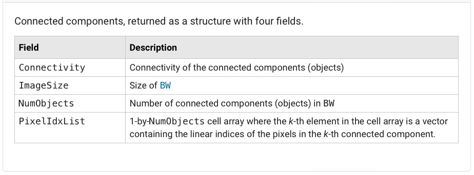

# Lab 4 - Morphological Image Processing
*_Peter Cheung, version 1.0, 8 Feb 2024_*


In this laboratory session, you will explore the use of various morphological operators and get a feel of how they modify visual information.  

As before, clone this repository to your laptop and keep your experimental logbook on your repo.  Some students add their results, observations, reflections, etc. directly onto the README.md file.  This turns the Lab Instruction into their logbook.  Clever move!

## Task 1: Dilation and Erosion

Matlab provides a collection of morphological functions.  Here is a list of them:

<p align="center">  </p>

### Dilation Operation
```
A = imread('assets/text-broken.tif');
B1 = [0 1 0;
     1 1 1;
     0 1 0];    % create structuring element
A1 = imdilate(A, B1);
montage({A,A1})
```

> Change the structuring element (SE) to all 1's.  Instead of enumerating it, you can do that with the function _ones_:
```
B2 = ones(3,3);     % generate a 3x3 matrix of 1's
```

> Try making the SE larger.
> Try to make the SE diagonal cross:
```
Bx = [1 0 1;
      0 1 0;
      1 0 1];
```

> What happens if you dilate the original image with B1 twice (or more times)?

### Generation of structuring element

For spatial filtering, we used function _fspecial_ to generate our filter kernel.  For morphological operations, we use function _strel_ to generate different kinds of structuring elements.

Here is a list of SE that _strel_ can generate:

<p align="center">  </p>

For example, to generate a disk with radius r = 4:

```
SE = strel('disk',4);
SE.Neighborhood         % print the SE neighborhood contents
```

_strel_ returns not a matrix, but an internal data structure called _strel_. This speeds up the execution of the morphological functions by Matlab.


### Erosion Operation

Explore erosion with the following:

```
clear all
close all
A = imread('assets/wirebond-mask.tif');
SE2 = strel('disk',2);
SE10 = strel('disk',10);
SE20 = strel('disk',20);
E2 = imerode(A,SE2);
E10 = imerode(A,SE10);
E20 = imerode(A,SE20);
montage({A, E2, E10, E20}, "size", [2 2])
```
Comment on the results.

## Task 2 - Morphological Filtering with Open and Close

### Opening = Erosion + Dilation
In this task, you will explore the effect of using Open and Close on a binary noisy fingerprint image.

1. Read the image file 'finger-noisy.tif' into _f_.
2. Generate a 3x3 structuring element SE.
3. Erode _f_ to produce _f_e.
4. Dilate _fe_ to produce _fed_.
5. Open _f_ to produce _fo_.
6. Show _f_, _fe_, _fed_ and _fo_ as a 4 image montage.

Comment on the the results.

Explore what happens with other size and shape of structuring element.

Improve the image _fo__ with a close operation.

Finally, compare morphological filtering using Open + Close to spatial filter with a **Gaussian filter**. Comment on your comparison.

## Task 3 - Boundary detection 

The grayscale image 'blobs.tif' consists of blobs or bubbles of different sizes in a sea of noise. Further, the bubbles are dark, while the background is white.  The goal of this task is to find the boundaries of the blobs using the boundary operator (Lecture 6, slide 17).

<p align="center">  </p>

First we turn this "inverted" grayscale image into a binary image with white objects (blobs) and black background. Do the following:

```
clear all
close all
I = imread('assets/blobs.tif');
I = imcomplement(I);
level = graythresh(I);
BW = imbinarize(I, level);
```
The Matlab function  _graythresh_ computes a global threshold _level_ from the grayscale image I, by finding a threshold that minimizes the variance of the thresholded black and white pixels. (This method is known as the [Otsu's method](https://cw.fel.cvut.cz/b201/_media/courses/a6m33bio/otsu.pdf).)  The function *_imbinarize_* turns the grayscale image to a binary image **BW**: those pixels above or equal to _level_ are made foreground (i.e. 1), otherwise they are background (0).

Now, use the boundary operation to compute the boundaries of the blobs. This is achieved by eroding BW  with SE, where SE is a 3x3 elements of 1's. The eroded image is subtract from BW. 

Diplay as montage {I, BW, erosed BW and boundary detected image}.  Comment on the result.

How can you improve on this result?

## Task 4 - Function bwmorph - thinning and thickening

Matlab's Image Processing Toolbox includes a general morphological function *_bwmorph_* which implements a variety of morphological operations based on combinations of dilations and erosions.  The calling syntax is:

```
g = bwmorph(f, operations, n)
```
where *_f_* is the input binary image, *_operation_* is a string specifying the desired operation, and *_n_* is a positive integer specifying the number of times the operation should be repeated. (n = 1 if omitted.)

The morphological operations supported by _bwmorph_ are:

<p align="center">  </p>

To test function *_bwmorph_* on thinning operation, do the following:

1. Read the image file 'fingerprint.tif' into *_f_*.
2. Turn this into a good binary image using method from the previous task. 
3. Perform thinning operation 1, 2, 3, 4 and 5 times, storing results in g1, g2 ... etc.
4. Montage the unthinned and thinned images to compare.

What will happen if you keep thinning the image?  Try thinning with *_n = inf_*.  (_inf_ is reserved word in Matlab which means infinity.  However, for _bwmorph_, it means repeat the function until the image stop changing.)

Modify your matlab code so that the fingerprint is displayed black lines on white background instead of white on black.  What conclusion can you draw about the relationship between thinning and thickening?

## Task 5 - Connected Components and labels

In processing and interpreting an image, it is often required to find objects in an image.  After binarization, these objects will form regions of 1's in background of 0's. These are called connected components within the image.  

Below is a text image containing many characters.  The goal is to find the **largest connected component** in this image, and then **erase it**.

<p align="center">  </p>

This sounds like a very complex task. Fortunately Matlab provides in their Toolbox the function _bwconncomp_ which performs the morphological operation described in Lecture 6 slides 22 - 24. Try the following Matlab script:

```
t = imread('assets/text.png');
imshow(t)
CC = bwconncomp(t)
```

*_CC_* is a data structure returned by *_bwconncomp_* as described below.

<p align="center">  </p>

To determine which is the largest component in the image and then erase it (i.e. set all pixels within that componenet to 0), do this:

```
numPixels = cellfun(@numel, CC.PixelIdxList);
[biggest, idx] = max(numPixels);
t(CC.PixelIdxList{idx}) = 0;
figure
imshow(t)
```
These few lines of code introduce you to some cool features in Matlab.

1. **_cellfun_** applies a function to each element in an array. In this case, the function _numel_ is applied to each member of the list **_CC.PixelIdxList_**.  The kth member of this list is itself a list of _(x,y)_ indices to the pixels within this component.

2. The function **_numel_** returns the number of elements in an array or list.  In this case, it returns the number of pixels in each of the connected components.

3. The first statement returns **_numPixels_**, which is an array containing the number of pixels in each of the detected connected components in the image. This corresponds to the table in Lecture 6 slide 24.

4. The **_max_** function returns the maximum value in numPixels and its index in the array.

5. Once this index is found, we have identified the largest connect component.  Using this index information, we can retrieve the list of pixel coordinates for this component in **_CC.PixelIdxList_**.

## Task 6 - Morphological Reconstruction

In morphological opening, erosion typlically removes small objects, and subsequent dilation tends to restore the shape of the objects that remains.  However, the accuracy of this restoration relies on the similarly between the shapes to be restored and the structuring element.

**_Morphological reconstruction_** (MR) is a better method that restores the original shapes of the objects that remain after erosion.  

The following exercise demonstrates the method described in Lecture 7 slide 10.  A binary image of printed text is processed so that the letters that are long and thin are kept, while all others are removed.  This is achieved through morphological reconstruction.

MR requires three things: an **input image** **_f_** to be processed called the **_mask**, a **marker image** **_g_**, and a structuring element **_se_**.  The steps are:

1. Find the marker image **_g_** by eroding the mask with an **_se_** that mark the places where the desirable features are located. In our case, the desired characters are all with long vertical elements that are 17 pixels tall.  Therefore the **_se_** used for erosion is a 17x1 of 1's.

2. Apply the reconstruction operation using Matlab's **_imreconstruct_** functino between the **marker** **_g_** and the **mask** **_f_**. 

The step are:

```
clear all
close all
f = imread('assets/text_bw.tif');
se = ones(17,1);
g = imerode(f, se);
fo = imopen(f, se);     % perform open to compare
fr = imreconstruct(g, f);
montage({f, g, fo, fr}, "size", [2 2])
```

Comment on what you observe from these four images.

Also try the function **_imfill_**, which will fill the holes in an image (Lecture 6 slides 19-21).

```
ff = imfill(f);
figure
montage({f, ff})
```

## Task 7 - Morphological Operations on Grayscale images

So far, we have only been using binary images because they vividly show the effect of morphological operations, turning black pixels to white pixels insted of just change the shades of gray.

In this task, we will explore the effect of erosion and dilation on grayscale images. 

Try the follow:

```
clear all; close all;
f = imread('assets/headCT.tif');
se = strel('square',3);
gd = imdilate(f, se);
ge = imerode(f, se);
gg = gd - ge;
montage({f, gd, ge, gg}, 'size', [2 2])
```
Comments on the results.

## Challenges

You may like to attemp one or more of the following challenges. Unlike tasks in this Lab where you were guided with clear instructions, you are required to find your solutions yourself based on what you have learned so far.  

1. The grayscale image file _'assets/fillings.tif'_ is a dental X-ray corrupted by noise.  Find how many fills this patient has and their sizes in number of pixels.

2. The file _'assets/palm.tif'_ is a palm print image in grayscale. Produce an output image that contains the main lines without all the underlining non-characteristic lines.

3. The file _'assets/normal-blood.png'_ is a microscope image of red blood cells. Using various techniques you have learned, write a Matlab .m script to count the number of red blood cells.

---
## DRAW Week Assessment
---

The first half of this module is assessed on your effort in completing Lab 1 to Lab 4.  This is done through your repo or "logbook", which should record what you have done in Lab 1 to Lab 4, including explanations and reflections on observations.  

This assessment accounts for 15% of the module.  The preferred route of submitting your logbook is through GitHub, but you may use other tools such as Notion or Obsidian.  You must complete the [SURVEY](https://forms.office.com/e/GLD0qYyxpS) and grant me access to them.  My GitHub account name is 'pykc'.

The deadline for this is **16.00 on Friday 14 February 2025**.  
