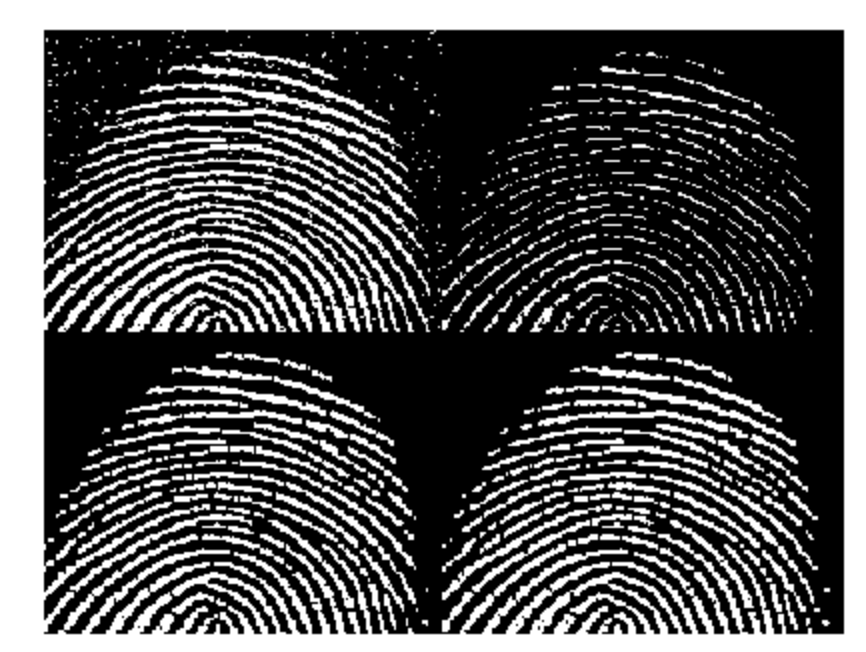

# Lab 4 Morphology notes

## Task 1: Dilation and Erosion

### Dilation Operation
```A = imread('assets/text-broken.tif');
B1 = [0 1 0;
     1 1 1;
     0 1 0];    % create structuring element

B2 = ones(3,3);     % generate a 3x3 matrix of 1's

B3 = ones(7,7);     % making it larger

Bx = [1 0 1;
      0 1 0;
      1 0 1];

A1 = imdilate(A, B2);
A2 = imdilate(A1, B2);
montage({A,A1, A2})


```
Increasing SE in dilation just makes it thicker.


> What happens if you dilate the original image with B1 twice (or more times)?

It bcomes thicker as well. 


## Generation of structuring element
disk or radius 4 is 
```
7x7 logical array

   0   0   1   1   1   0   0
   0   1   1   1   1   1   0
   1   1   1   1   1   1   1
   1   1   1   1   1   1   1
   1   1   1   1   1   1   1
   0   1   1   1   1   1   0
   0   0   1   1   1   0   0

```

### Erosion Operation
```
clear all
close all
A = imread('assets/wirebond-mask.tif');
SE2 = strel('disk',2);
SE10 = strel('disk',10);
SE20 = strel('disk',20);
E2 = imerode(A,SE2);
E10 = imerode(A,SE10);
E20 = imerode(A,SE20);
montage({A, E2, E10, E20}, "size", [2 2])
```

The larger the disk radius, the more of the foreground is eroded. 

## Task 2 - Morphological Filtering with Open and Close

### Opening = Erosion + Dilation

*Just playing around*
```
clear all
close all
A = imread('assets/fingerprint-noisy.tif'); % there's a problem with the file name.

B1 = ones(3,3);
B2 = [0 1 0;
     1 1 1;
     0 1 0];  
Bx = [1 0 1;
      0 1 0;
      1 0 1];

SE2 = strel('disk',2);
SE10 = strel('disk',10);
SE20 = strel('disk',20);

EB1 = imerode(A,B1);
EB2 = imerode(A,B2);
EBx = imerode(A,Bx);

E2 = imerode(A,SE2);
E10 = imerode(A,SE10);
E20 = imerode(A,SE20);

montage({A, EB1, EB2, EBx, E2, E10, E20})
```


It sems like a dense SE like all ones 3x3 is eroding more. + shape is giving sharp edges, cross is giving clear edges. Large radius ones are not suitable as it erodes way too much.



This is with 3x3 ones.comparing erode + dilate v.s open. Mathematically it should be the same but fed and fo are different. seems like fed is more eroded than fo. WHY????


with a cross shape SE, there is no significant difference. 


closing after opening makes it more sharp.

# Task 3 - Boundary detection

```
clear all
close all
I = imread('assets/blobs.tif');
I = imcomplement(I);
level = graythresh(I);
BW = imbinarize(I, level);

SE = ones(3,3);

EBW = imerode(BW,SE);

Boundary= BW - EBW;

montage({I, BW, EBW, Boundary})
```


```
clear all
close all
I = imread('assets/blobs.tif');
I = imcomplement(I);
level = graythresh(I);
BW = imbinarize(I, level);

SE = ones(10,10);

SER = strel('disk',5);


EBW = imerode(BW,SER);
Boundary= BW - EBW;

EBW2 = imerode(BW,SE);
Boundary2= BW - EBW2;

montage({I, BW, EBW, EBW2, Boundary, Boundary2})
```

Increasing EW size, or switching to larger radius based SE function both helped. 


# Task 4 - Function bwmorph - thinning and thickening

keep thining means that it vanishes. 


From inversing ,comparing thining and thickening - the inverse of the thickened is similar to the original BW thining.

# Task 5 - Connected Components and labels
```
clear all
close all
t = imread('assets/text.png');
imshow(t)
CC = bwconncomp(t);

numPixels = cellfun(@numel, CC.PixelIdxList);
[biggest, idx] = max(numPixels);
t(CC.PixelIdxList{idx}) = 0;
figure
imshow(t)
```

# Task 6 - Morphological Reconstruction
Morphological reconstruction (MR) is a better method that restores the original shapes of the objects that remain after erosion.

 
Erotion elminates everythin, opening picks up thicker features. 
The features become more readible after reconstruction, some letters were recognised.


imfill, hole filling , does fill the holes!

# Task 7 - Morphological Operations on Grayscale images


This is a Morphological Gradient operation, which gives the clear edges of differnet components of the scalop, making it easy to identify structural abnormality.

# Task 8 - Challenge 1
The grayscale image file 'assets/fillings.tif' is a dental X-ray corrupted by noise. Find how many fills this patient has and their sizes in number of pixels.


NUmber of filing is 11 and the sizes are 
467523           1           1           1           1           1           1           1           1           1           1
